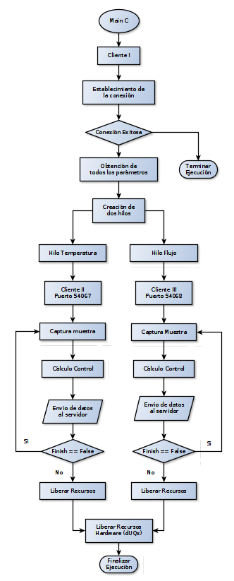

# Realtime Project C Client
Este repositorio contiene la implementación de la aplicación en C que se encarga de realizar el muestreo y control del proceso (Planta de flujo y temperatura), para dar cumplimiento al proyecto de la electiva de Tiempo Real.

## Instalación del firmware de la tarjeta de adquisición.

Antes de comenzar a hacer uso de este software debe asegurarse de instalar el _firmware_ dUQx (desarrollado por phD. Alexander Parrado) en su tarjeta Arduino Uno, las instrucciones para Linux se presentan a continuación.

En Linux instale la herramienta _avrdude_ con el comando `sudo apt-get install avrdude`, posteriormente ubique su terminal en la carpeta donde se encuentra el código fuente de este repositorio y (teniendo conectado el Arduino Uno y conociendo el puerto USB donde se encuentra conectado) ejecute la siguiente línea en la terminal.

```bash
avrdude -Cavrdude.conf -v -patmega328p -carduino -P/dev/ttyUSB0 -b57600 -D -Uflash:w:duqx.hex:i
```
Observe la opción _-P/dev/tty**USB0**_, en este caso mi tarjeta Arduino se conectó al puerto identificado como __USB0__, en su caso deberá modificar este parámetro por el puerto USB que corresponda a su tarjeta Arduino.

## Arquitectua General del Cliente


## Información de Código Fuente

### Tipos de Datos
* __control_data_t__: Es una estructura de datos que contiene información tanto del proceso de control como de recursos hardware. La definición de esta estructura de datos es la siguiente:
```cpp
typedef struct
{
	/*Board related info*/
	int usbPort;
    int analogInput;
    int analogOutput;
    int resolution;
    
    /*Controller related info*/
    double setpoint;
    double kp;
    double ki;
    double kd;
    double currentTime;
    double normalTs; //sample time in seconds
    process_time_t sampleTime;
} control_data_t;
```
* __client_data_t__: Corresponde a una estructura de datos que almacena todo aquello referente tanto al servidor, información del cliente, sockets, etc. La definición de este tipo de dato se presenta a continuación:
```cpp
typedef struct
{
	int serverSocket;
    int clientSocket;
    int port;
    int requestValue;
    int serverAnswer;
} client_data_t;
```

* __process_time_t__: Este tipo de dato corresponde a una redefinición que se presenta a continuación, con el fin de facilitar su interpretación y las declaraciones de variables del tipo __time_spec__:
```cpp
typedef struct timespec process_time_t;
```

## Compilación:
Para compilar este cliente en C solo debe ejecutar en la terminal el comando `make `, 
en seguida aparecerá en su directorio (junto a los archivos fuente) el ejecutable
de nombre `main` y que puede ser puesto en marcha escribiendo `./main`.

## Notas Importantes:
Tenga en cuenta que el funcionamiento tanto de servidor como de cliente se presenta en el siguiente orden:

* Ejecute el servidor Java en una terminal (solo ejecute, no inicie la adquisición aún)
* Ejecute el cliente en C en otra terminal (./main y verifique que ningún error se haya generado en ninguna de las dos terminales)
* Puede dar inicio a la adquisición de datos presionando el botón adecuado en la interfaz gráfica del servidor Java


