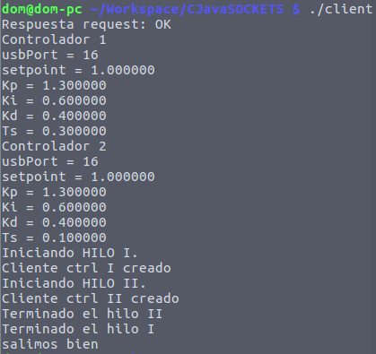
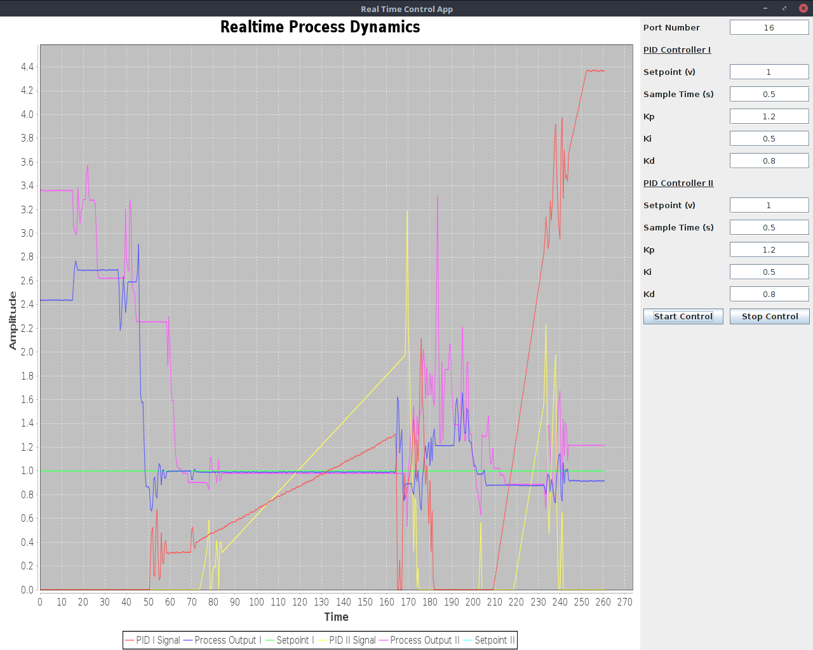

# Realtime Project C Client
Este repositorio contiene la implementación de la aplicación en C que se encarga de realizar el muestreo y control del proceso (Planta de flujo y temperatura), para dar cumplimiento al proyecto de la electiva de Tiempo Real.

## Instalación del firmware de la tarjeta de adquisición.

Antes de comenzar a hacer uso de este software debe asegurarse de instalar el _firmware_ dUQx (desarrollado por phD. Alexander Parrado) en su tarjeta Arduino Uno, las instrucciones para Linux se presentan a continuación.

En Linux instale la herramienta _avrdude_ con el comando `sudo apt-get install avrdude`, posteriormente ubique su terminal en la carpeta donde se encuentra el código fuente de este repositorio y (teniendo conectado el Arduino Uno y conociendo el puerto USB donde se encuentra conectado) ejecute la siguiente línea en la terminal.

```bash
avrdude -Cavrdude.conf -v -patmega328p -carduino -P/dev/ttyUSB0 -b57600 -D -Uflash:w:duqx.hex:i
```
Observe la opción _-P/dev/tty**USB0**_, en este caso mi tarjeta Arduino se conectó al puerto identificado como __USB0__, en su caso deberá modificar este parámetro por el puerto USB que corresponda a su tarjeta Arduino.

## Arquitectua General del Cliente


## Información de Código Fuente

### Tipos de Datos
* __control_data_t__: Es una estructura de datos que contiene información tanto del proceso de control como de recursos hardware. La definición de esta estructura de datos es la siguiente:
```cpp
typedef struct
{
	/*Board related info*/
	int usbPort;
    int analogInput;
    int analogOutput;
    int resolution;
    int finishFlag;
    double refVolt;

    /*Controller related info*/
    double setpoint;
    double processOutput;
    double swapProcessOutput;
    double controllerOutput;
    double swapControlOutput;
    double error;
    double iTerm; // integral term
    double lastProcessOutput;
    double kp;
    double ki;
    double kd;
    double currentTime;
    double normalTs; //sample time in seconds
    double currentTimeSwap;
    process_time_t sampleTime;
} control_data_t;
```
* __client_data_t__: Corresponde a una estructura de datos que almacena todo aquello referente tanto al servidor, información del cliente, sockets, etc. La definición de este tipo de dato se presenta a continuación:
```cpp
typedef struct
{
	char ip[15];
	int serverSocket;
    int clientSocket;
    int port;
    int requestValue;
    int serverAnswer;
} client_data_t;
```

* __process_time_t__: Este tipo de dato corresponde a una redefinición que se presenta a continuación, con el fin de facilitar su interpretación y las declaraciones de variables del tipo __time_spec__:
```cpp
typedef struct timespec process_time_t;
```
Se realizó además la siguiente definición de tipo para dar soporte al tipo booleano:
```cpp
typedef enum{false, true} bool;
```

## Funciones:
El cliente en C que se dedica al muestreo y control de los dos procesos independientes, hace uso de diferentes funciones. Principalmente en esta implementación se hace uso de rutinas desarrollodas por el doctor Alexander López Parrado (uqeasysocket.a y dUQx firmware), en este caso las funciones se listan a continuación a grandes rasgos con una breve descripción de su uso.

**dUQx API**:
* **int dUQx_init**(*puerto*):
* **dUQx_ReadAnalogSingle**(*int adcNumber*, *double voltRef*, *double ** buffer):
* **dUQx_WriteAnalog**(*double value*, *double voltRef*, *int pwmChannel*):

**uqeasysocket API**:
* **int client_create**(const char *serverIP, int socketPort, int &serverSocket):
* **swapbytes**(void *buffer, size_t numberOfBytes):
* **send_data**(int serverSocket, void *buffer, size_t numberOfBytes):
* **receive_data**(int serverSocket, void *buffer, size_t numberOfBytes):
* **close_socket**(int serverSocket):

**Funciones específicas desarrolladas para esta aplicación**:
* **void  GetControlSignal**(control_data_t * controlData):
* **process_time_t GetTimeStruct**(double Ts):
* **void ShowParameters**(control_data_t *controller):
* **void GettingParameters**(client_data_t \*client, control_data_t \*controllerOne, control_data_t *controllerTwo): Esta función se encarga de llenar los objetos pasados como referencia, con los datos provenientes del servidor (que en última instancia son datos del usuario). Es de suma importancia tener en cuenta el orden de llegada de los datos desde el servidor, dicho orden se describe a continuación:
##### Orden del paso de parámetros desde el servidor
	 * **CONTROLLER ONE**
         * usbPort
         * Ts
         * setpoint
         * kp
         * ki
         * kd

	 * **CONTROLLER TWO**
         * Ts
         * setpoint
         * kp
         * ki
         * kd

## Ejemplo de Funcionamiento

Como se comenta en las **notas** al final de esta documentación, por ahora existe una forma ordenada de iniciar la aplicación de forma correcta (en posteriores versiones el procedimiento será transparente para el usuario), es muy importante iniciar en primer lugar el servidor deserrollado en Java, luego se ejecuta el cliente (en este caso llamado *client*), cuando se obtenga una salida en la terminal del cliente que indique *Respuesta request: OK* quiere decir que el servidor dio una respuesta positiva y el sistema está listo para arrancar a funcionar.

En la interfaz gráfica del servidor el usuario puede ingresar los datos respectivos para su sistema de control (*periodos de muestreo* y *ganancias*). Una vez el usuario inicie el proceso de control todos estos valores serán enviados al cliente y reportados por el mismo a través de la terminal de comandos, de esta forma se puede tener la seguridad de que los parámetros se envían y se reciben correctamente. Un ejemplo se muestra en la siguiente imagen.



Como nota importante, recuerde tener la tarjeta **dUQx** conectada a su computadora e identificar el puerto **USB** correspondiente, cuando identifique el puerto al que está conectada, remitase a la documentación de **dUQx** para que ingrese el parámetro señalado como **Port Number** de acuerdo con la nomenclatura mostrada en aquel documento. En la siguiente imagen se aprecia el funcionamiento de la aplicación y en el parámetro **Port Number** se ingresó *16* ya que la tarjeta en aquel momento estaba conectada en el puerto **ttyUSB0** (para más información remitase a la documentación de la tarjeta **dUQx**).



En la captura anterior, se pueden ver los valores capturados de un proceso, particularmente esta captura solo muestra el resultado de las tensiones presentes en unos potenciometros que simulan las salidas de la planta a controlar y por esta misma razón se pueden ver las salidas de los controladores presentando una dinámica bastante brusca.


## Compilación:
Para compilar este cliente en C solo debe ejecutar en la terminal el comando `make `, en seguida aparecerá en su directorio (junto a los archivos fuente) el ejecutable de nombre `client` y que puede ser puesto en marcha escribiendo `./client`.

## Notas Importantes:
Tenga en cuenta que el funcionamiento tanto de servidor como de cliente se presenta en el siguiente orden:

* Ejecute el servidor Java en una terminal (solo ejecute, no inicie la adquisición aún)
* Ejecute el cliente en C en otra terminal (./main y verifique que ningún error se haya generado en ninguna de las dos terminales)
* Puede dar inicio a la adquisición de datos presionando el botón adecuado en la interfaz gráfica del servidor Java


